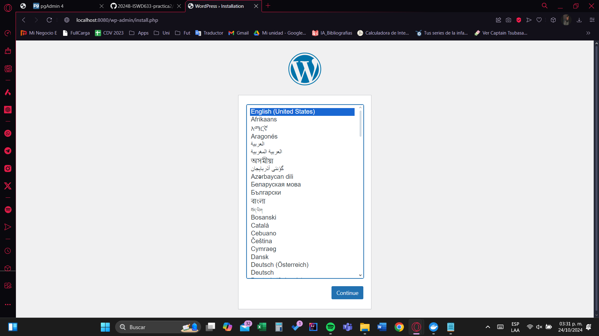

## Esquema para el ejercicio


### Crear la red
```
docker network create net-wp
```

### Crear el contenedor mysql a partir de la imagen mysql:8, configurar las variables de entorno necesarias
```
docker run -d --name mi_mysql -e MYSQL_ROOT_PASSWORD=junior2003 -e MYSQL_DATABASE=mi_base_de_datos -e MYSQL_USER=geovanny -e MYSQL_PASSWORD=junior03 mysql:8
```
```
docker network inspect net-wp
```

### Crear el contenedor wordpress a partir de la imagen: wordpress, configurar las variables de entorno necesarias
```
docker run -d --name mi_wordpress -e WORDPRESS_DB_HOST=mi_mysql:3306 -e WORDPRESS_DB_USER=geovanny -e WORDPRESS_DB_PASSWORD=junior03 -e WORDPRESS_DB_NAME=mi_base_de_datos -p 8080:80 wordpress
```
```
docker network connect net-wp mi_wordpress
```

De acuerdo con el trabajo realizado, en la el esquema de ejercicio el puerto a es 3000

Ingresar desde el navegador al wordpress y finalizar la configuración de instalación.
# COLOCAR UNA CAPTURA DE LA CONFIGURACIÓN



Desde el panel de admin: cambiar el tema y crear una nueva publicación.
Ingresar a: http://localhost:9300/ 
recordar que a es el puerto que usó para el mapeo con wordpress
# COLOCAR UNA CAPTURA DEL SITO EN DONDE SEA VISIBLE LA PUBLICACIÓN.

### Eliminar el contenedor wordpress
# COMPLETAR

### Crear nuevamente el contenedor wordpress
Ingresar a: http://localhost:9300/ 
recordar que a es el puerto que usó para el mapeo con wordpress

### ¿Qué ha sucedido, qué puede observar?
# COMPLETAR


